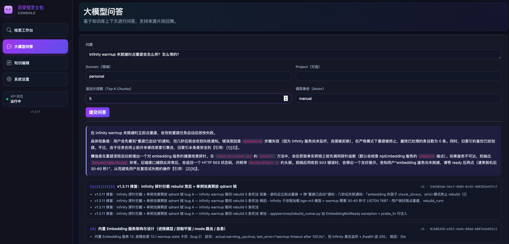

# 百变怪芝士包 / Knowledge Base System

[](https://opensource.org/licenses/Apache-2.0)
[](https://www.python.org/)
[]()

面向工程研发的本地知识记忆系统，让 Claude Code / Codex 在编码时能检索历史决策、排障记录和工程规范。



> Claude Code 通过 MCP 召回当天刚落档的 bug 修复记忆——人写的知识，AI 当天可查。

---

## 为啥用这个 / Why use this?

- 🔒 **本地隐私优先**：所有数据（笔记 / 向量索引 / 备份）都存本地，不离开设备；嵌入服务三选一（内置 infinity / 外部 OpenAI 兼容 / 关闭走关键词），完全可控。
- 🤖 **MCP 原生集成**：开箱即用接 Claude Code / Codex，让 AI 编码时检索你的历史决策、排障笔记、工程规范——把"AI 一问就忘"变成"AI 越用越懂你"。
- 📦 **双击即用**：Mac DMG / Windows EXE 直装版，零 Docker 零 Python 环境配置门槛，托盘 / 菜单栏 App 管启停。
- 🎯 **混合检索**：BM25 关键词召回 + Qdrant 向量语义召回 + 可选 Rerank，精确匹配和语义检索全覆盖。
- 💾 **数据保护**：升级自动备份 + 主动 export/import + maintenance 模式串行化，避免数据损坏；备份恢复支持 overwrite/merge 双模式 + 严格 confirm token 防误触发。

---

## 产品形态 / Deployment Modes

### 直装版（主路线）

无需 Docker / Python 环境，安装包双击即用。

- 存储：SQLite + Qdrant 嵌入模式
- 托盘/菜单栏 App 管理启停
- 业务配置写入数据库（`/settings` 页面修改），端口由 `config/config.toml` 引导
- 安装结构（Windows，安装到 `%LocalAppData%\KnowledgeBase\`）：
  ```
  bin\kb-api.exe              FastAPI 服务进程
  bin\kb-tray.exe             托盘程序
  config\config.toml          引导配置（端口、数据路径）
  scripts\local-restart-direct.ps1   /v1/system/restart 调用的直装版重启脚本
  agent-integration\          Claude / Codex 接入工具包（MCP 代理 + Skill + 安装脚本）
  app.ico                     桌面快捷方式图标
  使用说明.md                 用户手册
  data\                       运行时数据（knowledge.db + qdrant_local，卸载保留）
  logs\                       运行时日志
  ```

- 安装结构（macOS，安装到 `/Applications/KnowledgeBase/`）：
  ```
  KnowledgeBaseMenuBar.app    菜单栏 App（Swift binary，启动 / 状态徽章 / 知识库管理菜单）
  bin/kb-api                  FastAPI 服务 binary（PyInstaller 单文件）
  config/config.toml          引导配置（端口、数据路径）
  scripts/                    kb-start/kb-stop/kb-status + 知识库管理脚本（kb-import-* 等）
  agent-integration/          Claude / Codex 接入工具包
  使用说明.md                  用户手册
  data/                       运行时数据（knowledge.db + qdrant_local，卸载保留）
  logs/                       运行时日志（api.log / api.err.log）
  ```
  升级自动备份另存 `~/Library/Application Support/KnowledgeBase/auto-backup/`（卸载保留）。

### Docker 版（规划中）

Docker 版在路线图上（v1.x 计划），当前先交付直装版主线。代码层面已保留 `KB_BACKEND=postgres` 路径与 `app/repository_postgres.py` 实现，便于未来 Docker 化 / 外部 Postgres 编排。

说明：EXE / Mac App 属于直装版交付物，不属于 Docker 版。

---

## 下载安装 / Download

### macOS（v1.3.10）

➡️ [KnowledgeBase-mac-direct-1.3.10.dmg](https://github.com/SliverSucks/knowledge-base-system-oss/releases/latest)

下载 DMG → 双击打开 → 双击 `Install.command`，安装到 `/Applications/KnowledgeBase/`。装好后菜单栏出现知识库图标，点「启动知识库」即可。

### Windows（即将发布）

代码已就绪（`windows-app/` + `scripts/build_direct_install.ps1`），**签名安装包构建中**。急需可参考 [docs/11-windows-tray-exe.md](docs/11-windows-tray-exe.md) 自行构建（需 Anaconda + Inno Setup）。

### 所有版本

[Releases 页面](https://github.com/SliverSucks/knowledge-base-system-oss/releases) — 含历史版本归档与发布说明。

---

## 快速启动（开发模式）/ Quick Start (Dev)

> 前提：已安装 Python 3.11+，已创建 `.venv`（见 `requirements-local.txt`）。

macOS / Linux：

```bash
./scripts/kb-start.sh    # 后台启动，PID 写入 data/.local_api.pid
./scripts/kb-stop.sh     # 停止
./scripts/kb-status.sh   # 查看状态 + 健康检查
```

Windows：

```powershell
powershell -ExecutionPolicy Bypass -File scripts\local-start.ps1
powershell -ExecutionPolicy Bypass -File scripts\local-stop.ps1
```

正式安装后由托盘 / 菜单栏 App 直接管理启停，无需手敲命令。

| 地址 | 用途 |
|------|------|
| http://127.0.0.1:18000/console | Web 控制台 |
| http://127.0.0.1:18000/settings | 系统配置（LLM / Embedding / Rerank） |
| http://127.0.0.1:18000/docs | Swagger API 文档 |
| http://127.0.0.1:18000/health | 健康检查 |

环境变量（脚本已内置，无需手动设置）：

```
KB_BACKEND=sqlite
SQLITE_PATH=data\knowledge.db
VECTOR_ENABLED=1
QDRANT_MODE=local
QDRANT_LOCAL_PATH=data\qdrant_local
```

---

## 系统配置 / System Config

业务配置（LLM、Embedding、Rerank、主题）写入数据库，无需 `.env` 文件。  
端口与数据路径由模式化启动入口管理（直装版 `config/config.toml`；Docker 版端口映射/环境变量）。

打开 `/settings` 页面修改后配置会持久化。
- 直装版修改 `service_port` 会回写 `config/config.toml`，返回 `restart_required=true`，重启后按新端口运行。
- Docker 版会返回 `runtime_port_managed_by=docker`，需在编排层更新端口映射后重启容器。

---

## Embedding 服务 / Embedding Service

语义检索基于向量 embedding 模型实现。本项目提供三种启用方式：

### 一、内置本地服务（推荐 · 直装版甜蜜点）

首次启动后访问 `/setup`，选「本地内置」即可一键安装：
- 系统会自动下载所选模型 + 安装 `infinity-emb` 子进程，全程后台保活
- 数据不离开本机，无外部 API 调用
- 子进程异常崩溃自动重启 ≤3 次，超限后落回关键词检索

### 二、外部 OpenAI 兼容服务

`/setup` 选「外部服务」，填 4 字段（base_url / api_key / model）即可。适合：
- 已有 Azure OpenAI / 私有 embedding 部署
- 想用更大模型（如 `text-embedding-3-large`）

### 三、跳过 / 关键词检索

不配 embedding 服务也能用，自动降级到 BM25 关键词检索。
适合：硬件资源紧张 / 只需精确匹配场景。

### 模型选择指南

| 模型 | dim | 磁盘 | 常驻内存 | 中英文 | 推荐场景 |
|------|-----|------|---------|-------|---------|
| **BGE-M3** ⭐ | 1024 | ~2.3 GB | ~1.5 GB | 多语言 | 默认选择,长文本 + 中英混合场景甜蜜点 |
| BGE-large-zh v1.5 | 1024 | ~1.3 GB | ~0.8 GB | 纯中文 | 纯中文场景,资源占用更小 |
| Qwen3-Embedding 0.6B | 1024 | ~1.2 GB | ~0.8 GB | 多语言 | 资源紧张时的轻量替代 |

### 操作 API

- `/setup` 首装引导页（三选一 → 模型网格 → 安装进度 SSE）
- `/settings` Embedding 服务分区（模式切换 / 重建索引 / 查看日志）
- **macOS 托盘** → 知识库管理 → 重建向量索引（v1.3 新增，原生 NSAlert 二次确认 + 后台跑 + 完成通知）
- 切模型 / 重建索引必须输入 `I-CONFIRM-OVERWRITE` 确认（AC22 防误触发）
- 重建期间可点「中止并回滚」恢复旧索引（AC23）

### v1.3 行为升级

- **mode 切换自动联动**：local↔external↔disabled 切换时后端自动 `bump_desired`，壳层 reconcile loop 真停 / 真启 infinity 子进程，无需用户手动管理
- **warmup 自愈**：infinity 首次加载慢于 120s 时，reconcile loop 检测到 `/health` 200 自动清除"加载中"卡死状态
- **升级保留数据**：Install.command 自动备份 + 注入 `data/` + `models/`（1-4 GB）+ `embedding-service/` 三个目录，APFS clonefile 瞬时完成；升级不重下 4GB 模型不重 pip 装
- **install 跳过已下载**：检测到本地模型权重完整（config.json + ≥50MB 权重文件）跳过 `snapshot_download` 整个 phase

### 故障诊断

embedding 服务由壳层 ProcessManager（Mac Swift / Windows Python）管理：
- 状态文件：`{data_root}/runtime/{install_status.json,pid,port,owner_token}`
- 日志：`{data_root}/logs/{pip.log,infinity.log}`
- 详细架构与排障流程见 [docs/15-embedding-service.md](docs/15-embedding-service.md)

---

## Agent 接入 / Agent Integration

接入方式：把安装目录下的 `agent-integration/安装说明.md` 丢给 Claude Code / Codex，
让 AI 助手按文档自助完成 MCP 注册 + Skill 安装 + 权限白名单合并。

示例提示：

```
请按 /Applications/KnowledgeBase/agent-integration/安装说明.md 帮我接入知识库。
```

或 Windows：

```
请按 C:\Users\<你的用户名>\AppData\Local\KnowledgeBase\agent-integration\安装说明.md 帮我接入知识库。
```

`agent-integration/` 下三份核心文件：

| 文件 | 用途 |
|---|---|
| `kb-mcp-proxy.py` | MCP server 实现，stdio ↔ kb-api HTTP |
| `SKILL.md` | Skill 行为规则主干，跨平台通用 |
| `安装说明.md` | 给 AI 读的安装指南，含各平台路径占位与微调点 |

详细接入流程：[docs/10-agent-integration.md](docs/10-agent-integration.md)

### Skill 手动安装（不想让 AI 自动接入时）

```bash
# Claude
mkdir -p ~/.claude/skills/knowledge-base-first
cp agent-integration/SKILL.md ~/.claude/skills/knowledge-base-first/SKILL.md

# Codex
mkdir -p ~/.codex/skills/knowledge-base-first
cp agent-integration/SKILL.md ~/.codex/skills/knowledge-base-first/SKILL.md
```

---

## Mac 直装打包 / macOS Direct Installer

```bash
# 1) 构建 kb-api 二进制（依赖 .venv + pyinstaller）
./scripts/build_mac_kb_api.sh

# 2) 生成直装 dmg（默认版本 1.0.0）
./scripts/build_mac_direct_install_dmg.sh
# 或：构建 api + 打包一步完成
./scripts/build_mac_direct_install_dmg.sh --build-api 1.0.0
```

产物位置：`dist/KnowledgeBase-mac-direct-<version>.dmg`

---

## 安全升级 / Safe Upgrade

直装版 DMG 的 `Install.command` 内置数据保护：

- **进程检测**：发现 `kb-api` 在跑则中文提示退出 App 后再装（防 SQLite / Qdrant 拿到不一致 snapshot）
- **自动备份**：升级前 cp 当前 `data/` 到 `~/Library/Application Support/KnowledgeBase/auto-backup/{ts}/`，含最小 manifest（trigger=install + before/after 版本号）
- **自动还原**：装完新版后把 data 还原回去（不还原 config，让新版默认引导生效）

auto-backup 历史快照**永久保留**，建议每季度手动清理。详见 [`docs/07-user-manual.md`](docs/07-user-manual.md) "全量备份恢复" 章节。

控制台 / HTTP API 也提供主动 `export` / `import`，支持 `overwrite` 与 `merge` 两种模式 + 严格 confirm token（`I-CONFIRM-OVERWRITE` / `I-CONFIRM-MERGE`）。备份包含 LLM/Embedding 凭证，**勿上传到公开仓库或通过未加密渠道发送**。

---

## 数据导入 / Data Import

```bash
# 导入单个 Markdown 文件
python scripts/import_markdown.py --file ~/notes/api-spec.md --project proj-a --domain work

# 批量导入目录
python scripts/import_directory.py --dir ~/docs --project proj-a --domain work

# 增量导入
python scripts/import_incremental.py --project proj-a --domain work
```

---

## 核心 API / Core API

| 方法 | 路径 | 说明 |
|------|------|------|
| POST | `/v1/knowledge/search` | 混合检索（关键词 + 向量） |
| GET | `/v1/knowledge/items/{id}` | 按 ID 获取条目 |
| POST | `/v1/knowledge/items/upsert` | 写入 / 追加新版本 |
| POST | `/v1/knowledge/ask` | 基于知识库的智能问答 |
| POST | `/v1/knowledge/import-incremental` | 增量导入目录 |
| POST | `/v1/knowledge/export-package` | 导出知识包 |
| POST | `/v1/knowledge/import-package` | 导入知识包（危险） |
| POST | `/v1/knowledge/clear` | 清空知识库（危险） |
| POST | `/v1/knowledge/cleanup-expired` | 清理过期知识（危险） |
| GET/PUT | `/v1/system/config` | 系统配置读写 |
| POST | `/v1/system/restart` | 按模式/平台分发重启 |

> 控制台内部接口（如软删除 `DELETE /v1/console/knowledge/items/{id}`）不在上表，仅供本地控制台调用，详见 [docs/04-retrieval-api.md](docs/04-retrieval-api.md) 第 4.5 节。

完整接口文档：[docs/04-retrieval-api.md](docs/04-retrieval-api.md)

---

## 目录结构 / Layout

```
app/                  # FastAPI 服务
  main.py             # 入口，路由
  repository_sqlite.py  # SQLite 数据层
  repository_postgres.py  # PostgreSQL 数据层（Docker 版）
  vector_index.py     # Qdrant 集成
  service.py          # 业务编排
  mcp_server.py / mcp_tools.py  # MCP 服务
  model_settings.py   # LLM / Embedding / Rerank 配置
  static/console/     # Web 控制台前端
  static/settings/    # 系统配置前端
scripts/              # 启停、导入、安装脚本
windows-app/          # Windows 托盘 App 源码
mac-app/              # Mac 菜单栏 App 源码
docs/                 # 设计与运维文档
tests/                # 单元测试
data/                 # 运行时数据（.gitignore）
  knowledge.db
  qdrant_local/
```

---

## 文档索引 / Docs

总导航：[`docs/README.md`](docs/README.md)（按"用户 / 开发运维"分区，且为唯一索引入口）
